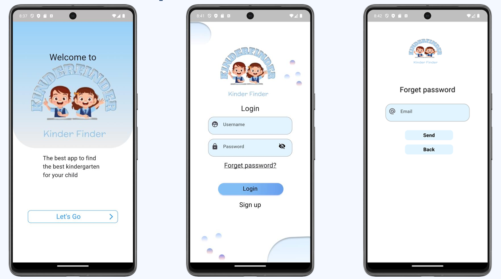
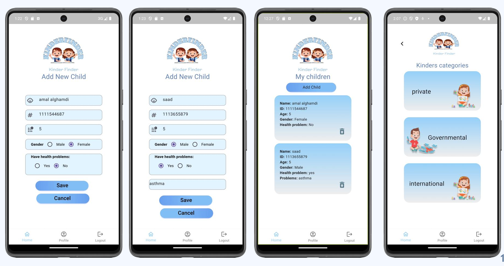

# KinderFinder 📱

> A Flutter-based mobile application that helps parents discover, compare, and enroll their children in kindergartens with ease.


---

## 📖 Overview

KinderFinder is a mobile application developed as a graduation project at **Taif University**.

The application simplifies the process of finding suitable kindergartens by allowing parents to search, compare, review, and register for kindergartens through one platform instead of relying on word-of-mouth recommendations.

---

## ✨ Features

- 🔍 Search kindergartens by city or preferred location.
- 🏫 View detailed kindergarten profiles.
- ⭐ Read ratings and reviews from other parents.
- 💰 Compare tuition fees.
- 🚌 View transportation availability.
- 📅 Check operating days and schedules.
- 📝 Register children directly through the application.
- 💳 Pay registration fees securely.
- 📱 Simple and intuitive mobile interface.

---

## 🛠️ Tech Stack

| Category | Technologies |
|----------|--------------|
| Mobile Development | Flutter, Dart |
| Backend | Firebase |
| Database | Firebase Firestore |
| UI Design | Figma |
| Project Management | Agile (Scrum) |
| Version Control | Git & GitHub |

---

## 📱 Screenshots

| | |
|---|---|
| 
 |


---

## 🏗️ System Workflow

1. User creates an account or logs in.
2. Search for kindergartens by location.
3. Browse kindergarten information.
4. Compare available options.
5. Read parent reviews.
6. Register a child.
7. Complete payment securely.

---

## 🚀 Installation

### Clone the repository

```bash
git clone https://github.com/Munira19/Kinder_Finder.git
```

### Navigate to the project

```bash
cd Kinder_Finder
```

### Install dependencies

```bash
flutter pub get
```

### Run the application

```bash
flutter run
```

---

## 📂 Project Structure

```
lib/
│
├── models/
├── screens/
├── widgets/
├── services/
├── providers/
└── main.dart
```

---

## 🎯 Project Objectives

- Help parents make informed decisions.
- Provide reliable kindergarten information.
- Reduce the time spent searching for schools.
- Improve accessibility to educational services.

---

## 📚 Development Methodology

This project was developed following the **Agile Scrum** methodology, allowing iterative development, continuous feedback, and collaborative teamwork throughout the project lifecycle.

---

## 👥 Team

- **Munirah Alorabi**
- Shahad Alghamdi
- Manar Altalhi
- Atheer Althobaity
- Manahel Alotaibi
- Saja Alzahrani

Department of Information Technology  
College of Computer Science and Information Technology  
Taif University

---

## 🔮 Future Enhancements

- AI-powered kindergarten recommendations.
- Interactive map integration.
- Push notifications.
- Online chat with kindergartens.
- Multi-language support.
- Advanced filtering options.

---

## 📄 License

This project was developed for academic purposes as a graduation project at Taif University.
